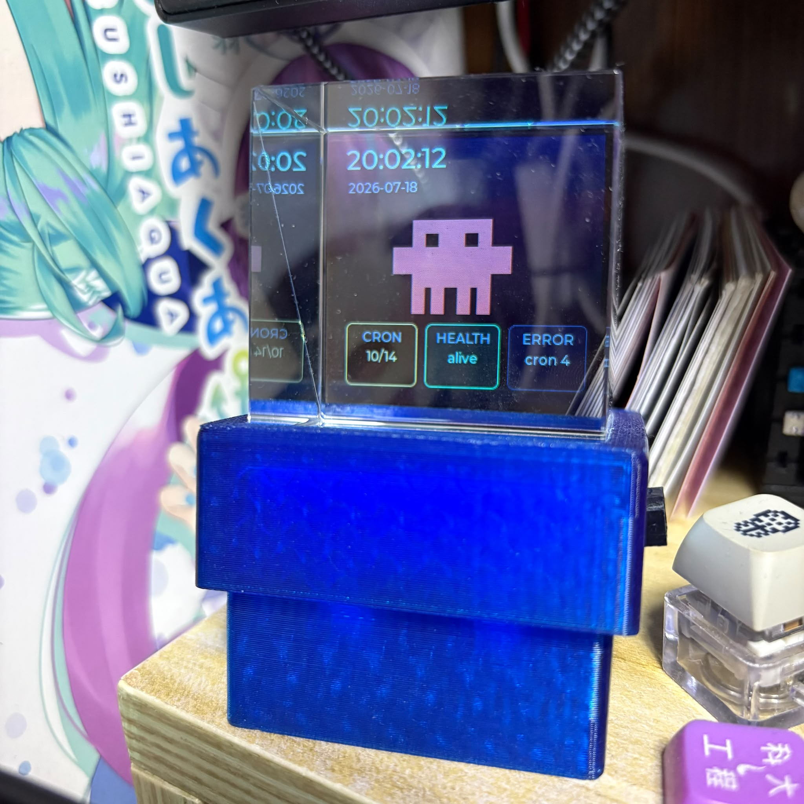
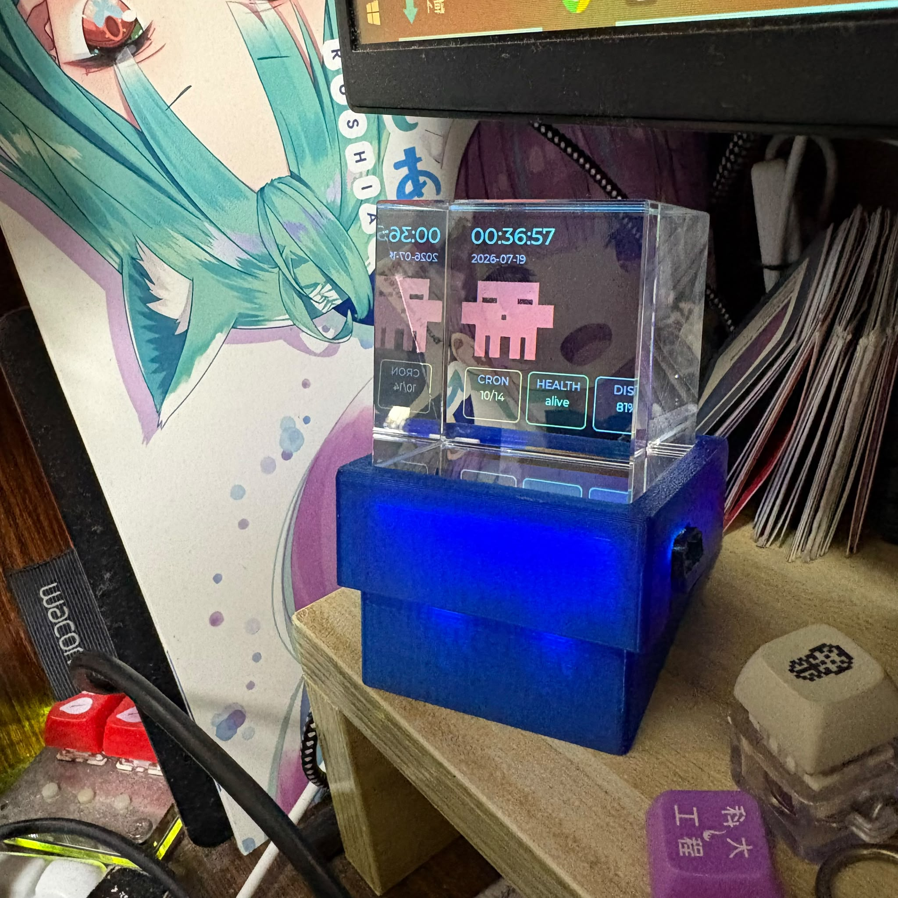
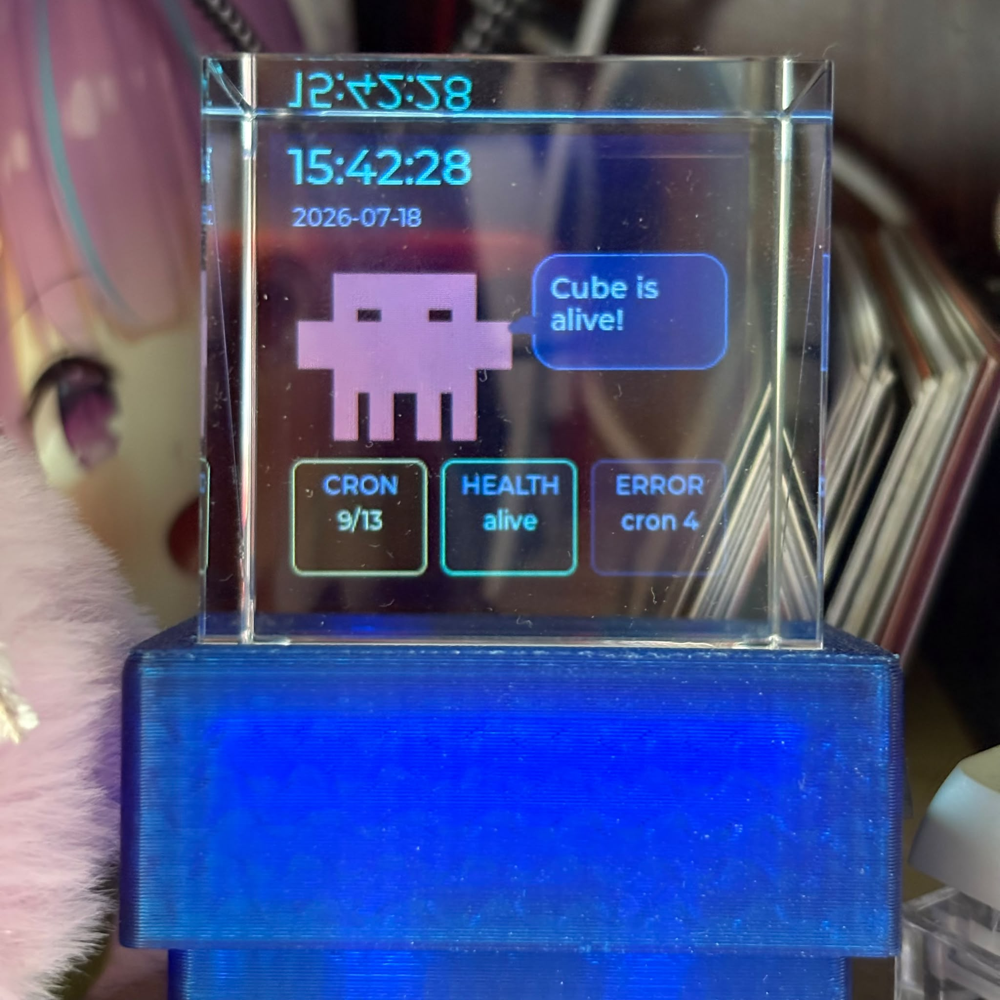

# ClawPetCube

[](#hardware)
[](#firmware)
[](#build)
[](#status)
[](LICENSE)

ClawPetCube is a small STM32 desk monitor for OpenClaw. It turns the original
VPetCube hardware into an always-on operations display: time, service health,
cron progress, resource pressure, and short pushed messages on a 240x240 LCD.

The active firmware is the STM32Cube HAL target in `hal_firmware/`. The old
Standard Peripheral Library firmware source tree has been removed from this
checkout after the HAL migration became the working path.

<p align="center">
  
  
  
</p>

## Contents

- [Status](#status)
- [What It Shows](#what-it-shows)
- [Hardware](#hardware)
- [Firmware](#firmware)
- [Build](#build)
- [Configuration](#configuration)
- [Repository Layout](#repository-layout)
- [Troubleshooting](#troubleshooting)
- [Docs](#docs)

## Status

| Area | State |
| --- | --- |
| STM32F405 HAL target | Active |
| ST-LINK flash/debug | Verified |
| ST7789 LCD + LVGL refresh | Verified |
| FreeRTOS UI task | Active |
| ESP8266 WiFi + HKO time sync | Verified |
| OpenClaw `/health`, `/status`, `/message` | Verified through cube HTTP endpoint |
| SDIO/FatFs | Pending hardware validation |
| MPU6050 | Pending hardware validation |
| USART6 touch/input | Pending hardware validation |
| Long-run dashboard stability | Pending 10-30 minute hardware run |

## What It Shows

- HKT time and date from ESP8266/HKO sync.
- A compact blocky mascot that keeps the cube companion-like without stealing
  dashboard space.
- A speech bubble for fresh pushed cube messages.
- `CRON` and `HEALTH` cards for at-a-glance service state.
- A rotating detail card for `PROC`, `DISK`, and `MEM`.
- A top-right alert pill only when time, network, health, fetch, or gateway
  state needs attention.

Normal operation keeps the screen calm. Serious OpenClaw or network failures
override the speech bubble and switch the detail card to `ERROR`.

## Hardware

| Part | Current target |
| --- | --- |
| MCU | STM32F405RGTx |
| Display | 240x240 ST7789-style SPI TFT |
| WiFi | ESP-12F / ESP8266 AT firmware on USART2 |
| Debug log | USART1 at 115200 through the board USB-C TTL bridge |
| Storage | SD card over SDIO |
| Sensor/input | MPU6050 over I2C1, USART6 touch/input events |
| Board | Original self-made VPetCube PCB |

## Firmware

The HAL firmware keeps the parts that are useful for the physical cube and moves
new work away from the old SPL codebase.

Implemented:

- HAL peripheral init for USART1, USART2, USART6, SPI1 + DMA, I2C1, SDIO, RTC,
  TIM3, TIM7, ADC1, GPIO, and EXTI5.
- ST7789 LCD compatibility driver using the original panel init sequence.
- LVGL 8.1.1 display port and active `lv_timer_handler()` loop.
- TIM3 LVGL tick fix for the original first-frame stall.
- ESP8266 AT transport with bounded recovery from `busy` and TCP failure states.
- HKO HTTP time sync and STM32 RTC update.
- OpenClaw health/status/message polling through a configured plain HTTP cube
  endpoint.
- Serial masking for local WiFi/API host commands.

Important constraint: the current ESP8266 AT firmware cannot reliably connect
directly to the private Cloudflare HTTPS endpoint. The working production path is
a cube-specific plain HTTP endpoint on port 80 that proxies OpenClaw data
server-side.

## Build

Use the CubeIDE bundled `make.exe` and GNU Arm toolchain. On this Windows setup,
plain `make` can resolve to MSYS and fail with `couldn't create signal pipe,
Win32 error 5`, so put the CubeIDE make directory first.

```powershell
$makePath = 'C:\ST\STM32CubeIDE_1.16.1\STM32CubeIDE\plugins\com.st.stm32cube.ide.mcu.externaltools.make.win32_2.1.300.202402091052\tools\bin'
$gccPath = 'C:\ST\STM32CubeIDE_1.16.1\STM32CubeIDE\plugins\com.st.stm32cube.ide.mcu.externaltools.gnu-tools-for-stm32.12.3.rel1.win32_1.0.200.202406191623\tools\bin'
$env:Path = $makePath + ';' + $gccPath + ';' + $env:Path
make -C Release all
```

Expected outputs:

- `Release/ClawPetCube_HAL.elf`
- `Release/ClawPetCube_HAL.hex`

If the build compiles `FWLIB/src/stm32f4xx_*.c`, defines
`USE_STDPERIPH_DRIVER`, or links `VPetCube.elf`, it is using stale generated
metadata from the removed SPL target instead of the HAL target.

## Configuration

Do not commit credentials or private hostnames. Keep local values in ignored
`hal_firmware/Core/Inc/app_config_local.h` or CubeIDE project symbols.

```c
#ifndef APP_CONFIG_LOCAL_H
#define APP_CONFIG_LOCAL_H

#define VPC_WIFI_SSID "..."
#define VPC_WIFI_PASSWORD "..."
#define VPC_OPENCLAW_HTTP_HOST "..."
#define VPC_OPENCLAW_HTTP_PORT "80"

#endif
```

The tracked `hal_firmware/Core/Inc/app_config.h` defaults these values to empty
strings.

## Repository Layout

| Path | Purpose |
| --- | --- |
| `hal_firmware/` | Active STM32Cube HAL firmware |
| `Middlewares/LVGL/` | Legacy LVGL 8.1.1 and GUI Guider sources used by the HAL build |
| `Release/` | Generated Eclipse/GNU MCU make target and firmware outputs |
| `assets/` | README and project images |
| `CLAWPETCUBE_PLAN.md` | Product and technical plan |
| `hal_firmware/OPENCLAW_BRINGUP_JOURNAL.md` | ESP8266/OpenClaw verification notes |
| `hal_firmware/LVGL_BRINGUP_JOURNAL.md` | LCD/LVGL bring-up root cause notes |
| `hal_firmware/MIGRATION_STATUS.md` | HAL migration status by subsystem |

## Troubleshooting

| Symptom | Check |
| --- | --- |
| `couldn't create signal pipe, Win32 error 5` | `make` is likely resolving to MSYS. Put CubeIDE `make.exe` first in `PATH`. |
| Build tries `FWLIB/` or `VPetCube.elf` | Generated metadata is stale or the wrong target is selected. Use the HAL `Release/ClawPetCube_HAL.*` target. |
| LCD shows first frame but stops updating | Check TIM3 MSP clock/IRQ and `lv_tick_inc()`; see `hal_firmware/LVGL_BRINGUP_JOURNAL.md`. |
| ESP8266 direct HTTPS fails | Use the cube plain HTTP endpoint; this AT firmware does not handle the private Cloudflare HTTPS path reliably. |
| Status shows stale/offline | Check ESP8266 WiFi, cube HTTP host/port config, and serial logs on USART1. |

## Docs

Read these first when continuing the project:

1. `CLAWPETCUBE_PLAN.md`
2. `hal_firmware/README.md`
3. `hal_firmware/OPENCLAW_BRINGUP_JOURNAL.md`
4. `hal_firmware/LVGL_BRINGUP_JOURNAL.md`
5. `hal_firmware/MIGRATION_STATUS.md`

## Background

ClawPetCube grew out of the HKUST ELEC3300 VPetCube project. The original web UI
and SPL firmware are no longer the active implementation in this checkout, but
the hardware idea remains: a small physical companion object with useful live
state on its display.

## License

This project is open source under the MIT License. See `LICENSE`.
