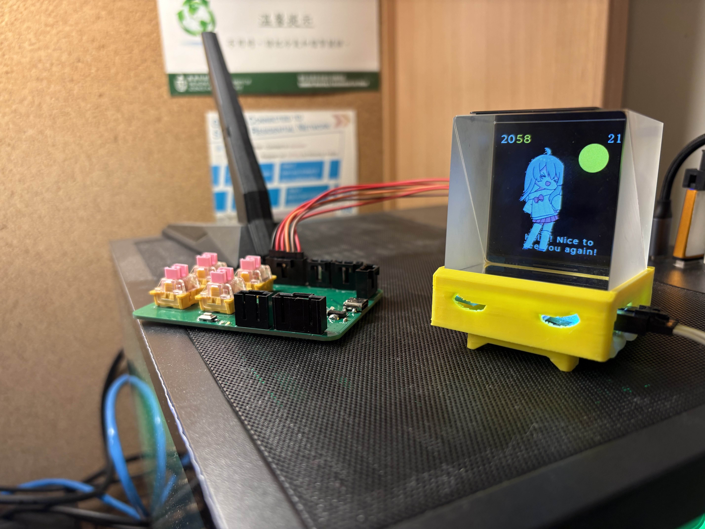
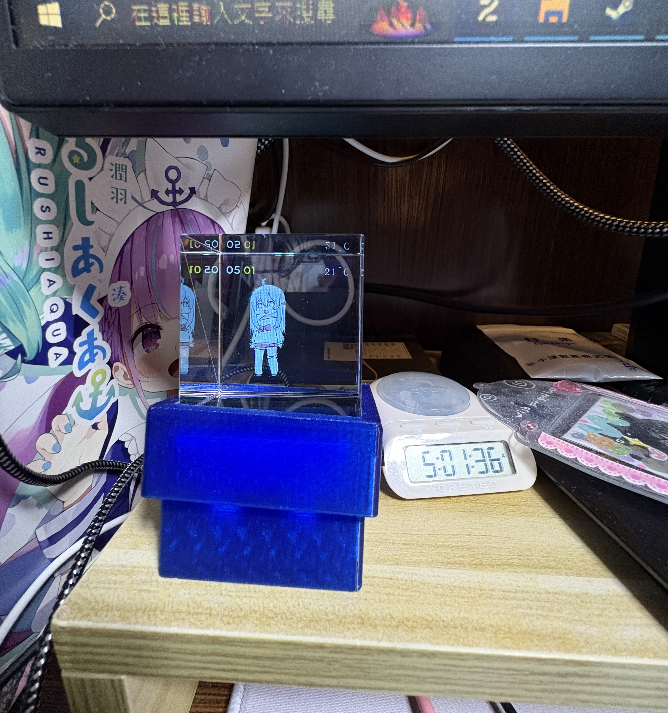

# VPetCube

## Introduction

VPetCube is a project developed as part of the HKUST course ELEC3300. Our goal is to bring the virtual pet experience into reality by combining holographic technology with an STM32 microcontroller. Inspired by the beloved VPet concept, we aim to create an interactive and engaging companion.

## Background

The VPetCube project builds on the graphics and concepts found in the [VPet repository](https://github.com/LorisYounger/VPet/blob/main/README_en.md). By leveraging modern technology, we seek to enhance the interaction between users and their virtual pets.

## Features

- **Web-based User Interface:** Located in the `elec3300` folder, developed using PHP CodeIgniter.
- **Study/Work Companion:** Sync your tasks by pressing 'Work' on the web interface, which communicates with the cube.
- **Feeding Interaction:** Users can feed their virtual pet through the interface.
- **Patting the Pet:** Touchpad sensors around the cube allow users to interact with the VPet via USART6.
- **Synchronized Weather Updates:** Utilizing the ESP8266, the cube fetches local weather data to keep users informed.
- **IMU Control:** An Inertial Measurement Unit (IMU) is being implemented to control the VPetCube by swinging it (currently half-completed).

## Hardware Specifications

- **IMU:** MPU6050 (I2C)
- **WiFi Module:** ESP-12F (UART)
- **Storage:** SD Card (SDIO)
- **Display:** SPI TFT (SPI)
- **Hardware Structure:** Self-made PCB

## Codebase

The project utilizes the standard library (stdlib) for implementation, ensuring a reliable and efficient coding environment.

## Getting Started

To get started with VPetCube, clone the repository and follow the instructions in the `elec3300` folder to set up the web-based interface and connect the hardware components.

## Contributions

We welcome contributions! If you have suggestions or improvements, please feel free to submit a pull request or open an issue.

## License

This project is open-source and available under the [MIT License](LICENSE).

## Contact

For any inquiries or feedback, please contact us at github issue

---

Thank you for your interest in VPetCube! We look forward to your support and contributions.
